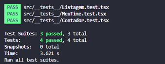

# Exame de recrutamento (React Native)
[](https://www.prodemge.gov.br/)


# Solução do Exame da PRODEMGE

Foi solicitada a alteração da lógica dos componentes MeuTime, Listagem e Contador.

-	Contador 
    -	Deve ser possível que a contagem funcione corretamente
        -	Para que esse teste passe, o componente deve fazer a contagem corretamente

-	MeuTime
    -	Deve ser possível mostrar o nome do time corretamente
        -	Para que esse teste passe, o componente deve exibir em tela o nome do time que é passado no atributo do componente
    -	Deve ser possível alterar o nome do time
        -	Para que esse teste passe, o componente deve exibir em tela o nome do time que foi alterado através do input

-	Listagem
    -	Deve ser possível listar todos os itens
        -	Para que esse teste passe, o componente deve exibir em tela todos os itens recebidos no parâmetro


**Observação:** Para que os testes funcionem corretamente é necessário que **altere somente os componentes** ```[Contador.tsx, MeuTime.tsx, Listagem.tsx]```, dito isso, faça as alterações que achar necessário dentro dos componentes


## SOLUÇÃO

* Contador: Erro na lógica da função incremetar, pois a variável não estava atualizando no componente, portanto foi necessária a utilização do UseState do React Native para atualizar o estado.

* Listagem: Erro no UseEffect, que após receber os dados estava voltando o array de strings "lista" para seu estado inicial que é vazio.

* MeuTime: Erro na lógica de alteração de visibilidade e atualização do texto do input para o componente Text.
## Resultado dos testes após alterações




